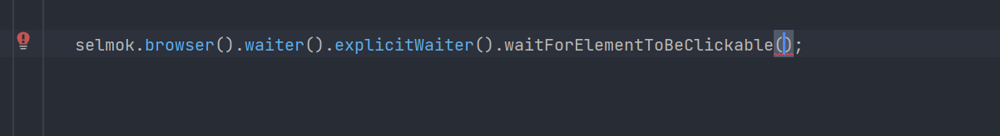

# SELMOK - extendable framework for test automation
Selmok is an extendable test automation framework, dedicated to improve efficiency and reduce efforts, spent on test automation involvement to the project by providing multiple components for different test automation tasks.

It includes self-implemented Selenium wrapper and data faker, available for modification and extension according to your project needs. 

Additionally, it provides logging and unit testing tools, widely used in test automation: Log4J 2 and TestNg.
## Technologies
+ Java 17
+ Gradle 8.5
+ Selenium 4
+ TestNG 7 
+ Log4J 2
+ Jackson 2

## Features
Different features are provided by different components. Please see the description of each component`s features below. 

**Data Faker**
+ generation of Strings with configuration for number, special characters and uppercase letters inclusion
+ generation of various numeric values (double, integer, float, long) either without ranges, inside of the range or with upper limit only
+ generation of first names and last names for different locales 
+ generation of full email addresses or [separate parts of email addresses](https://testbook.com/question-answer/what-is-included-in-an-e-mail-address--6070c13b62360e80b8450f7e#:~:text=Every%20email%20address%20has%20two,followed%20by%20the%20domain%20name.) with various options of configuration (e.g. local part as random String, local part as first and last name with specific separator, full email address with fake domain or one provided by user, etc)
+ generation of passwords with specific length and configuration options for inclusion of numbers, uppercase letters and special characters

**Selenium Wrapper**
+  wrappers for Selenium waits, open for modification, reduce or extension. Wraps popular methods, specific for different types of Selenium waiters to increase usability of the tool
+ wrapper for methods of both Action and WebDriver classes with popular practices implemented (e.g. waiter before element click is added by default to click method)
+ wrapper for WebDriver itself with Singleton pattern implemented

For features of TestNG please refer to [TestNG documentation](https://testng.org/). Similarly, to get familiar with Log4J features, please refer to [Log4J documentation](https://logging.apache.org/log4j/2.x/).

## Installation
### Prerequisits
Before starting please ensure that you have the following tools installed: 
+ [Git](https://www.git-scm.com/)
+ [Gradle](https://gradle.org/) at least 8.5 version
+ Java 17 (can be either [OpenJDK](https://openjdk.org/), [Amazon-corretto](https://aws.amazon.com/corretto/?nc1=h_ls&filtered-posts.sort-by=item.additionalFields.createdDate&filtered-posts.sort-order=desc), [OracleJDK](https://www.oracle.com/java/technologies/downloads/))

### Steps
1. Clone the project from GitHub 
2. In terminal (e.g. cmd, shell, IDE terminal, etc) navigate to the project directory
3. Run build Gradle command `gradle build` to install all the dependencies 
4. Enjoy usage =)

## Usage
To get started, the Selmok object should be initialized.

Selmok is the object, that provides the access to all the framework`s components (except of those, already included as dependencies). 

It is implemented with Builder design patter to handle situations with more than two components included to framework. 

The Generator object, empty or initialized with desired locale and random class instance, can be provided to it. The Browser class instance, initialized with WebDriver object can be provided as well. 

To access the generator methods, on Selmok object the generator() method should be called as below. 

Let`s say we want to generate a first name. Then the name().firstName() sequence should be called on generator() method.

Similarly, for email the corresponding email() method can be called, for passwords credentials() and for things such as random String or numbers, the random() method. Then the corresponding method can be chosen and called on those method`s names. 

To access the Selenium wrapper classes, the browser() method should be called on Selmok object. 

To call methods of waiters, the waiter() method should be called then. For example to call the wait for clickability of element:

Similarly, the action methods can be called. For example method for mouse over and click: 

The driver itself can be invoked with browserDriver() method: 

Even the JSExecutor driver can be called from Selmok object: 

